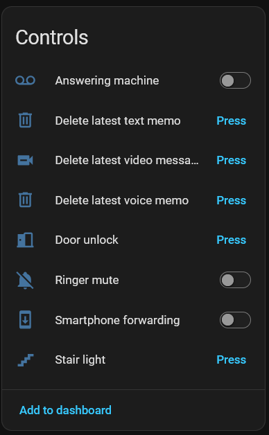
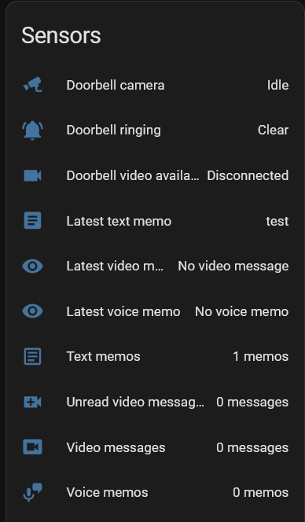
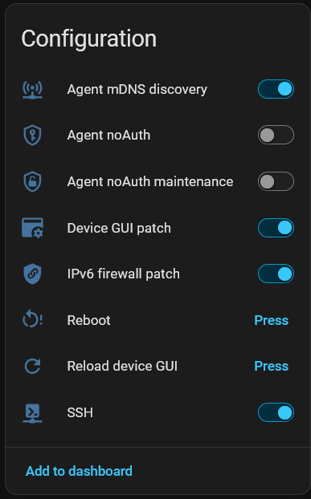
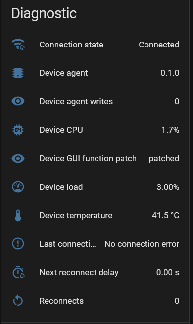

# BTicino Classe 300X for Home Assistant (Unofficial)

[](.github/workflows/validate.yml)
[](custom_components/bticino_c300x/quality_scale.yaml)
[](.github/release-notes/v0.3.1.md)
[](https://www.hacs.xyz/)
[](LICENSE)

Local-first Home Assistant custom integration for the BTicino Classe 300X /
C300X video door station.

The project pairs a Home Assistant integration with a small native C agent on
the C300X. The goal is a quiet, local, event-driven setup: no Node.js runtime on
the device, no polling controller, no cloud dependency for normal operation, and
no fake Home Assistant entities.

<p align="center">
  
</p>

## Status

- Current release line: `0.3.1`
- Home Assistant requirement: `2026.5.0` or newer
- IoT class: `local_push`
- HACS type: custom integration with `zip_release`
- Quality target: Home Assistant Quality Scale Platinum track
- License: Apache-2.0
- Support scope: community project, not an official BTicino/Legrand or Home
  Assistant Core integration

## Highlights

- Native C device agent for the C300X, built without Node.js or `node_modules`.
- Local push callbacks into Home Assistant instead of periodic polling.
- Bearer-token API plus a separate maintenance token for sensitive actions.
- Capability-gated entities: Home Assistant only shows functions the installed
  agent actually supports.
- Doorbell ring events and on-demand doorbell camera.
- WebRTC-facing Home Assistant camera path, with the native RTSP bridge started
  only when video is needed.
- Door unlock and stair-light actions.
- Ringer mute, smartphone forwarding, answering machine and message support.
- Video-message playback/delete, voice-memo playback/delete and text-memo
  visibility/delete.
- Optional C300X display pages for Alarmo and a dynamic Home Assistant board.
- Multilingual C300X display labels with German, Italian and English text.
- Optional mDNS bootstrap discovery for Home Assistant Zeroconf.
- Low-noise diagnostics for connection state, write counters and device
  metrics.

## Screenshots

Screenshots show a representative setup. Exact entities and display pages depend
on the installed agent capabilities and the options enabled in Home Assistant.

### Home Assistant Entities

<table>
  <tr>
    <td align="center"><strong>Controls</strong><br></td>
    <td align="center"><strong>Sensors</strong><br></td>
  </tr>
  <tr>
    <td align="center"><strong>Configuration</strong><br></td>
    <td align="center"><strong>Diagnostics</strong><br></td>
  </tr>
</table>

### C300X Display Pages

<table>
  <tr>
    <td align="center"><strong>C300X dashboard</strong><br></td>
    <td align="center"><strong>Alarmo page</strong><br></td>
  </tr>
  <tr>
    <td align="center"><strong>Home Assistant weather page</strong><br></td>
    <td align="center"><strong>Custom Home Assistant page</strong><br></td>
  </tr>
</table>

### Display Bridge Output

<p>
  
</p>

## Important Requirement: Rooted C300X

The native agent must run on the C300X device. That means the device must already
be rooted or otherwise SSH-enabled with write access for installing the agent.

This repository does not provide firmware images, firmware extraction output,
APKs, exploits, rooting instructions, or vendor files. If your device is still
stock, you first need a separate, compatible rooting/firmware-patching workflow.
One commonly referenced community project for that topic is:

```text
https://github.com/fquinto/bticinoClasse300x
```

Use that kind of workflow at your own risk and only where it is legal for your
device and jurisdiction. After SSH/root access is available, this integration
can install and manage the native agent.

## What You Get in Home Assistant

Exact entities depend on the capabilities reported by your installed agent.

| Platform | Typical entities |
| --- | --- |
| `camera` | Doorbell camera |
| `event` | Standard doorbell ring event, readable device-agent event stream |
| `binary_sensor` | Video window availability |
| `button` | Door unlock, stair light, reboot, reload GUI, remove device agent, delete latest memo/message |
| `switch` | Ringer mute, smartphone forwarding, answering machine, SSH maintenance, noAuth bootstrap, mDNS, GUI patch, firewall patches |
| `sensor` | Agent version, connection state, reconnect diagnostics, QML patch status, messages, memos, optional device metrics |

The integration also registers services for door unlock, stair light, Alarmo
commands, dashboard actions, latest video-message playback/delete, latest
voice-memo playback/delete and latest text-memo delete.

## Recommended Installation

### 1. Install the Home Assistant integration

HACS custom repository:

1. Open **HACS**.
2. Go to **Integrations**.
3. Open **Custom repositories**.
4. Add this repository:

   ```text
   https://github.com/memphi2/ha-bticino-c300x
   ```

5. Category: **Integration**.
6. Install **BTicino C300X**.
7. Restart Home Assistant.

Manual Home Assistant install:

```bash
mkdir -p /config/custom_components
cp -a custom_components/bticino_c300x /config/custom_components/
```

Then restart Home Assistant.

The HACS release asset is `ha-bticino-c300x.zip`. It contains the Home Assistant
integration and the matching ARMHF native-agent bundle. Normal users should not
need Node.js, npm, a cross compiler, or SSH helper tools inside Home Assistant.

### 2. Add the integration

In Home Assistant:

```text
Settings -> Devices & services -> Add integration -> BTicino C300X
```

The setup flow first asks for the C300X address and local agent API port.

- If the native agent is already reachable, setup continues with token and
  feature configuration.
- If the agent is not reachable, setup offers an explicit installer step for a
  rooted/SSH-enabled C300X.

The installer uses the SSH username/password only for that install step. The
credentials are not stored in the Home Assistant config entry, options,
diagnostics, or logs.

### 3. Token Storage and Recovery

During installer-based setup, Home Assistant generates two random tokens:

- the device-agent API bearer token
- the maintenance token for sensitive actions such as reboot, GUI patching,
  firewall patching and remove-agent

The installer writes both tokens into the C300X agent config:

```text
/home/bticino/cfg/extra/c300x-native-agent/config.json
```

The JSON fields are:

```text
api.token
maintenance.adminToken
```

Home Assistant stores its own copy in the integration config entry/options and
uses it automatically. Do not copy these values into issues, logs, screenshots,
commits or documentation.

If you need the exact token later, prefer the Home Assistant reconfigure/options
flow when you still know it. For recovery, read the device config over SSH from
the path above, or set new tokens through the agent `/setup` page while noAuth
bootstrap access is still enabled. The `/setup` page shows only whether tokens
are configured and their fingerprints; it does not reveal existing token values.

### 4. What the installer puts on the device

The installer deploys project-owned files only:

- ARMHF native C agent binary
- generated `config.json` with generated API and maintenance tokens
- init/start script for the native agent
- QML support files for the optional C300X display pages
- QML patch helper script
- optional firewall helper state managed by the native agent

The installer does not ship vendor firmware, extracted firmware files, APKs,
Node modules, or third-party controller code.

### 5. Choose optional features

The feature step lets you enable only what you need:

- Doorbell camera/video
- C300X display GUI integration
- Alarmo entity for the display page
- Weather entity for the display page
- Dynamic Home Assistant board JSON
- Native MQTT bridge migration
- Stair-light address
- Optional maintenance controls

The GUI patch is explicit. Normal Home Assistant startup must not patch the
device UI. When enabled, the patch process backs up original QML files once,
renders the target files, compares byte-for-byte, writes only changed files,
remounts the root filesystem writable only for the final copy, and returns it to
read-only immediately afterwards.

### MQTT Migration

Some rooted Classe 300X devices already have an older community MQTT patch
installed. That path is useful for existing automations, but it usually runs as
separate helper processes outside this integration. On a small C300X this can
mean extra idle CPU load, duplicate event handling, more filesystem writes, and
unclear ownership when Home Assistant and the old patch both try to represent
the same device state.

This integration therefore includes an optional native MQTT bridge in the C
agent. It is meant as a controlled migration path, not as a second mandatory
transport. The bridge can use the broker settings you configure in the agent
JSON and can expose legacy-compatible topics for setups that still depend on
them. Only one MQTT path should be active at a time: either keep the legacy
bridge disabled, or migrate to the native bridge and disable/remove the old
device-side MQTT patch through the maintenance controls.

The migration is explicit. The installer and maintenance entities can detect
whether legacy MQTT support is present, back up device-side legacy files before
removal where needed, and restore them during remove-agent where possible. The
goal is to keep old automations working while moving runtime work into the
single low-idle native agent.

### Alarmo Display Page

The C300X alarm display page is built and tested for
[Alarmo](https://github.com/nielsfaber/alarmo). It uses Alarmo-style state,
readiness, bypass and code behavior exposed through Home Assistant. Other
`alarm_control_panel` entities may expose the same basic entity domain, but they
are not guaranteed to provide the same readiness and bypass semantics.

Thanks to Niels Faber, the developer of Alarmo, for building and maintaining the
Home Assistant alarm integration this display page is designed around.

### IPv6 Recommendation

IPv6 is optional, but recommended when your Home Assistant network already uses
stable IPv6 addressing. Home Assistant, browsers, and HA Cloud/WebRTC paths may
prefer IPv6 when it is available; enabling the agent's IPv6 firewall support
lets those callbacks and camera sessions use the same predictable network path
instead of falling back to fragile name resolution or link-local addresses.

Use stable ULA or global IPv6 addresses for Home Assistant and the C300X. Avoid
link-local callback URLs such as addresses that require an interface suffix.
The IPv6 firewall patch should only be enabled when the device and your network
are actually configured for IPv6, and the agent must still remain on a trusted
local network.

## Security Model

Use this only on a trusted local network.

- Do not expose the agent API, setup page, display bridge, RTSP/WebRTC media
  ports or the C300X device directly to the internet.
- Use strong random API and maintenance tokens.
- Keep `noAuth` disabled after bootstrap.
- Keep noAuth maintenance disabled after bootstrap.
- Keep maintenance functions disabled unless actively needed.
- Mutating API endpoints use `POST`.
- The display UI listener is local to the device and separate from the
  Home-Assistant-facing API.
- Diagnostics redact secrets and avoid private callback URLs.

The native agent intentionally does not include a TLS stack. Use plain HTTP only
on a trusted local segment, or terminate HTTPS in a local reverse proxy if your
network design requires it. Home Assistant Cloud access should go through Home
Assistant's own camera/WebRTC handling, not by exposing the C300X agent.

See [SECURITY.md](SECURITY.md).

## Performance Model

The integration is designed for low idle cost:

- no periodic Home Assistant polling loop for normal C300X state
- persisted event subscriptions instead of webhook rotation on every start
- no background still-image camera polling
- RTSP/video bridge starts on demand
- display bridge config is updated only when it differs
- QML patching is explicit and writes only changed files
- diagnostics expose write counters so idle writes are visible

Optional system metrics are disabled by default and should be enabled only when
you actually want device diagnostics.

## Maintenance and Removal

Maintenance entities are exposed only when the agent advertises support and the
integration is configured with the required token.

Useful maintenance controls can include:

- SSH maintenance switch
- reboot button
- GUI reload button
- GUI patch switch
- IPv4/IPv6 firewall patch switches
- mDNS bootstrap switch
- noAuth bootstrap switches
- remove device agent button

Use **Remove device agent** when you want to uninstall the device-side runtime.
The agent removes its own files, restores GUI/firewall patches first when
possible, and leaves SSH available so the device remains reachable.

## Troubleshooting

- Connection issues: verify the agent host, port, API token, firewall patch, and
  that `http://<agent-host>:8091/api/v1/health` is reachable from Home
  Assistant.
- Missing entities: entities are capability-gated. If the agent does not report
  a capability through `/api/v1/capabilities`, Home Assistant will not create the
  matching entity.
- Camera issues: keep video enabled in the integration options and avoid
  link-local callback/stream URLs, especially with HA Cloud or mixed IPv4/IPv6
  networks.
- Memo/message issues: updates are event-driven. Check the subscription state
  and the agent capabilities; there should be no periodic memo scan.

## Project Background and Attribution

Thanks to SlyOldFox for the public C300X groundwork and original community
controller work, and to Niels Faber for Alarmo, which the optional C300X alarm
page is designed around.

Development has been assisted by OpenAI Codex. The resulting code and
documentation are maintained as normal project artifacts in this repository.

## Legal Notes

This repository is an independent community project.

- Unofficial integration: no affiliation with, endorsement by, or sponsorship
  from BTicino, Legrand, Home Assistant, Nabu Casa, HACS, OpenAI, or the
  referenced community projects.
- Trademark notice: BTicino, Classe 300X, Legrand, Home Assistant, HACS, Nabu
  Casa, OpenAI, Codex and other names are used only for compatibility,
  attribution, or descriptive reference and belong to their respective owners.
- This repository does not include vendor firmware, extracted firmware, APKs,
  third-party controller source trees, local device backups, or secrets.
- License: Apache-2.0, see [LICENSE](LICENSE) and [NOTICE](NOTICE).

See [docs/legal.md](docs/legal.md) for the full legal and asset-hygiene notes.

## Documentation

| Topic | Document |
| --- | --- |
| User guide | [docs/user-guide.md](docs/user-guide.md) |
| Native agent details | [docs/native-agent.md](docs/native-agent.md) |
| Architecture | [docs/architecture.md](docs/architecture.md) |
| Device UI feasibility and safety | [docs/device-ui-feasibility.md](docs/device-ui-feasibility.md) |
| Security policy | [SECURITY.md](SECURITY.md) |
| Privacy notice | [PRIVACY.md](PRIVACY.md) |
| Legal notes | [docs/legal.md](docs/legal.md) |
| Changelog | [CHANGELOG.md](CHANGELOG.md) |

## Development Checks

```bash
python3.14 -m venv .venv
. .venv/bin/activate
pip install -r requirements-dev.txt

.venv/bin/python scripts/check_repo.py
.venv/bin/ruff check .
.venv/bin/python -m pytest
make -C native_agent check
make -C native_agent armhf-abi-check armhf-stack-check
```
