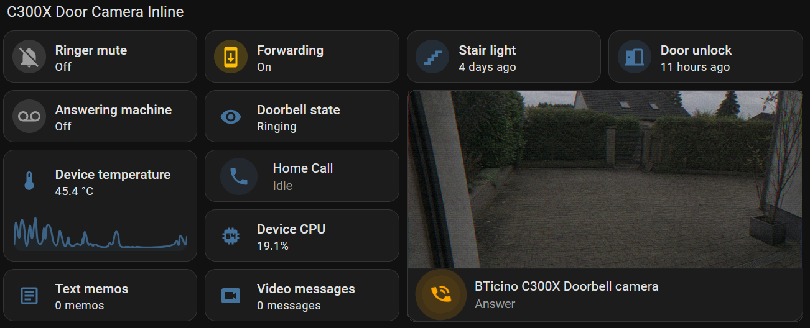
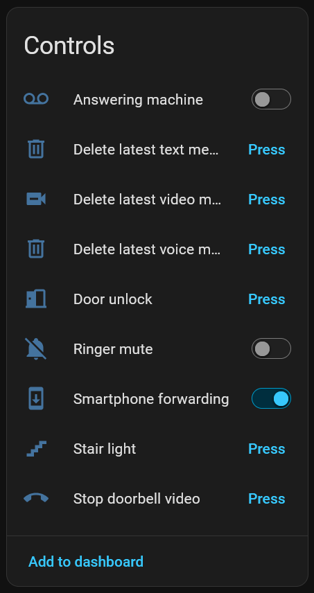
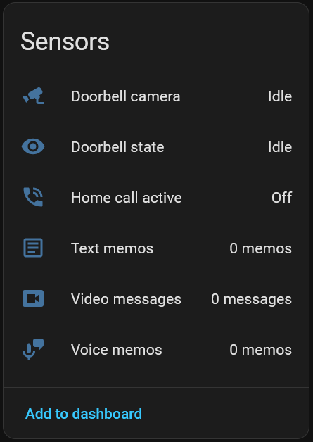
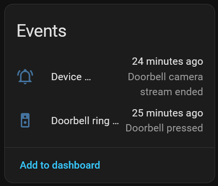
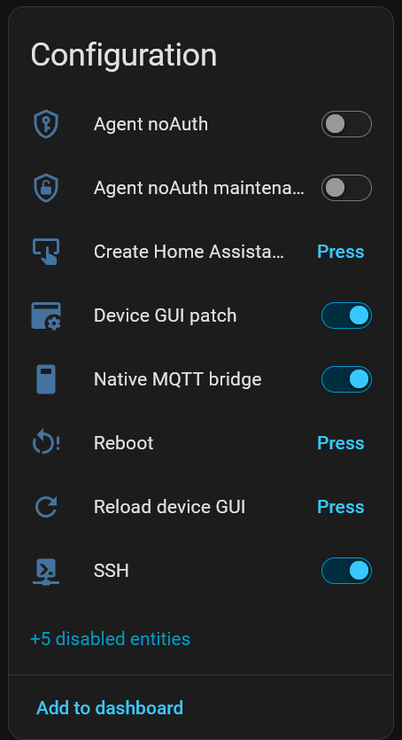
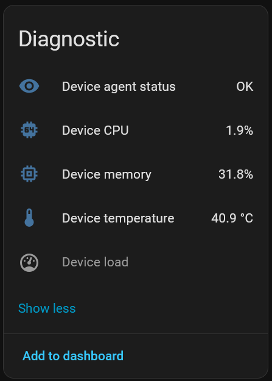
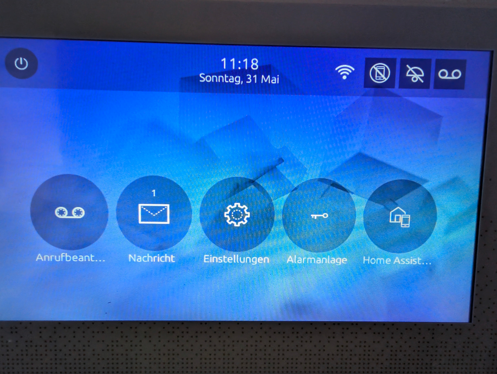
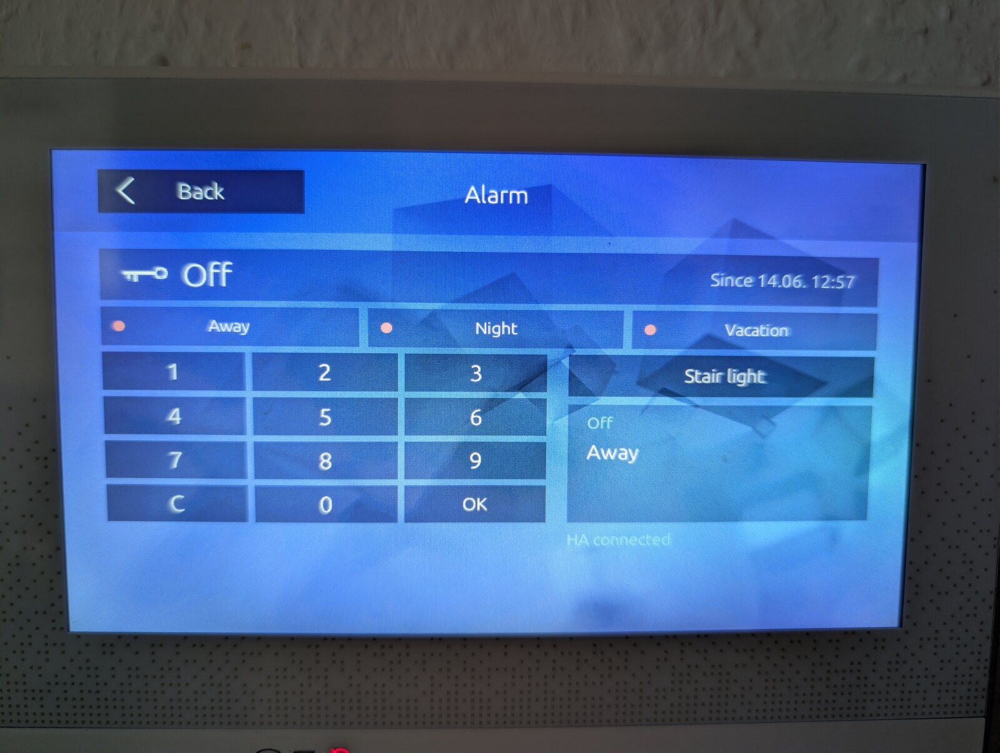
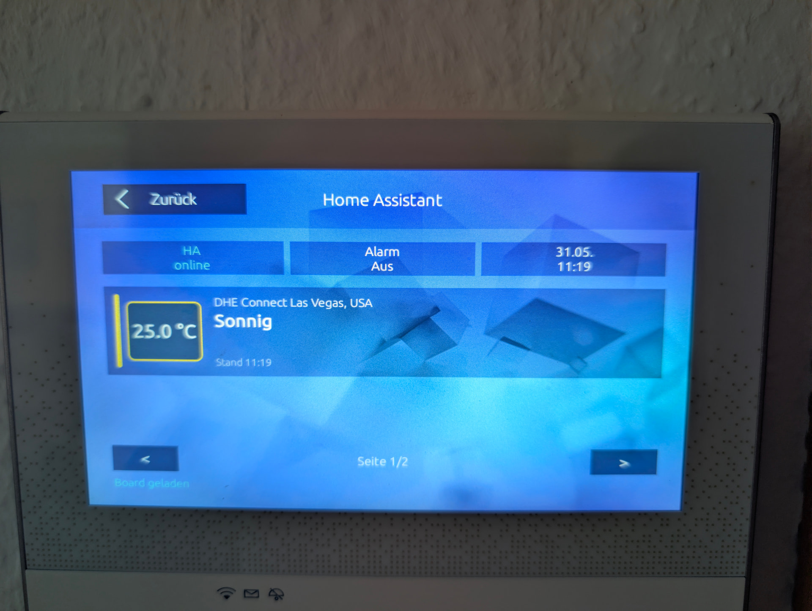
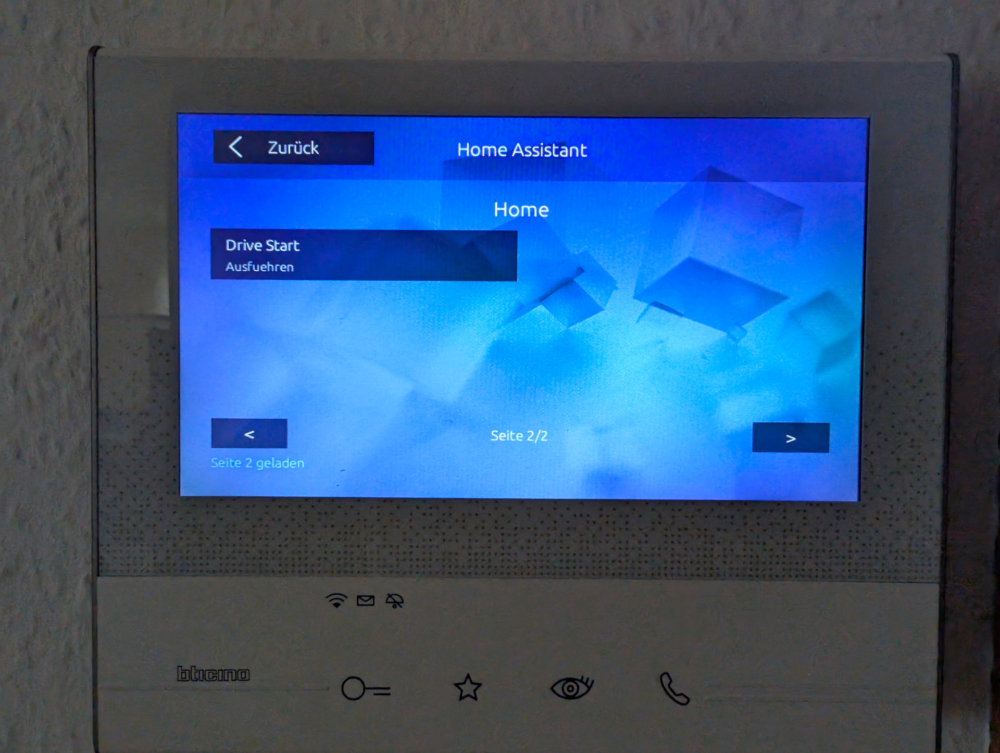

# BTicino Classe 300X for Home Assistant (Unofficial)

[](.github/workflows/validate.yml)
[](custom_components/bticino_c300x/quality_scale.yaml)
[](CHANGELOG.md)
[](https://www.hacs.xyz/)
[](LICENSE)

Local-first Home Assistant custom integration for the BTicino Classe 300X /
C300X video door station.

It brings the C300X into Home Assistant as a local device: doorbell events,
camera view, Ring Call handling, Home Call, door unlock, stair light, ringer and
forwarding controls, messages and optional display pages.

<p align="center">
  
</p>

## What You Get

- Doorbell ring events and local camera viewing.
- Ring Call answer/hang-up from Home Assistant when forwarding is set to Home
  Assistant.
- Audio-only Home Call from Home Assistant to the C300X display.
- Talkback from a secure Home Assistant frontend with microphone permission.
- Door unlock, stair light, ringer mute, forwarding and answering-machine
  controls.
- Stored video messages, voice memos and text memos when the agent reports
  those capabilities.
- Optional C300X display pages for Alarmo, weather and selected Home Assistant
  entities.
- Media readiness diagnostics with guided Repairs for the common setup problems.
- Optional automation blueprints for notifications, Ring Capture, local Wyoming
  transcription and strict phrase decisions.

## Requirements

- Home Assistant `2025.5.0` or newer.
- BTicino Classe 300X / C300X firmware `1.7.x`.
- Rooted or SSH-enabled C300X for the first device-agent installation.
- A trusted local network between Home Assistant and the C300X.

If your device is still stock, root or SSH-enable it first with a separate
workflow. This repository does not provide firmware images, firmware extraction
output, APKs, exploits, rooting instructions or vendor files. If another
workflow asks for a firmware target, use `1.7.19`. Everything is used at your
own risk and without warranty.

## Screenshots

Screenshots show one representative setup. Exact entities and display pages
depend on enabled options and installed agent capabilities.

### Door Camera Inline Dashboard

<p align="center">
  
</p>

### Home Assistant Entities

<table>
  <tr>
    <td align="center" valign="top"><strong>Controls</strong><br></td>
    <td align="center" valign="top"><strong>Sensors / Events</strong><br><br></td>
    <td align="center" valign="top"><strong>Configuration</strong><br></td>
    <td align="center" valign="top"><strong>Diagnostics</strong><br></td>
  </tr>
</table>

### C300X Display Pages

<table>
  <tr>
    <td align="center"><strong>C300X dashboard</strong><br></td>
    <td align="center"><strong>Alarmo page</strong><br></td>
  </tr>
  <tr>
    <td align="center"><strong>Home Assistant weather page</strong><br></td>
    <td align="center"><strong>Custom Home Assistant page</strong><br></td>
  </tr>
</table>

## 5-Minute Setup

Start with the guided setup document:

**[Quickstart: install, agent, Media readiness, card](docs/quickstart.md)**

The short path is:

```text
HACS -> add integration -> install/update agent -> Media readiness
-> Fix now if needed -> add the C300X card
```

Keep the first install boring: get **Media readiness** to `ready`, then add the
bundled card. Blueprints, display pages and advanced maintenance can wait until
the three media paths work.

After an update, run the C300X Lovelace card Repair if Home Assistant offers it
and hard-reload the browser if the card picker still shows old frontend state.

## Documentation

| User documentation | Link |
| --- | --- |
| 5-minute setup path | [Quickstart](docs/quickstart.md) |
| Task-focused user guide | [User guide](docs/user-guide.md) |
| Media readiness states and fixes | [Media readiness](docs/media-readiness.md) |
| Answer, Talkback, Home Call or stream problems | [Media troubleshooting](docs/media-troubleshooting.md) |
| Ready-made automations | [Blueprints](docs/blueprints.md) |
| SSH, firewall, Display patch, remove agent | [Advanced maintenance](docs/advanced-maintenance.md) |
| Hardware release checks | [Release validation](docs/release-validation.md) |

| Maintainer documentation | Link |
| --- | --- |
| Architecture and data flow | [Architecture](docs/architecture.md) |
| Native agent runtime and packaging | [Native agent](docs/native-agent.md) |
| Native agent HTTP API contract | [Native Agent API](native_agent/API.md) |
| Device QML display pages | [Device QML UI](device_qml/README.md) |
| Quality scale tracking | [Quality scale](docs/quality-scale.md) |
| Privacy, security, and legal notes | [Privacy](PRIVACY.md), [Security](SECURITY.md), [Legal notes](docs/legal.md) |
| Historical evidence and baselines | [Provenance audit](docs/audits/2026-06-22-provenance.md), [Media refactor baseline](docs/dev/media-refactor-baseline.md) |
| Release history | [Changelog](CHANGELOG.md) |

## Project Status

- IoT class: `local_push`
- HACS type: custom integration with `zip_release`
- Quality target: Home Assistant Quality Scale Platinum track
- License: Apache-2.0
- Support scope: community project, not an official BTicino/Legrand or Home
  Assistant Core integration

## AI Assistance

- This project was developed with AI assistance, including Codex.

## Legal Notes

This repository is an independent community project. It is not affiliated with,
endorsed by, sponsored by, or certified by BTicino, Legrand, Home Assistant,
Nabu Casa, HACS or the referenced community projects.

This repository does not include vendor firmware, extracted firmware, APKs,
third-party controller source trees, local device backups, private captures or
secrets. See [docs/legal.md](docs/legal.md).
