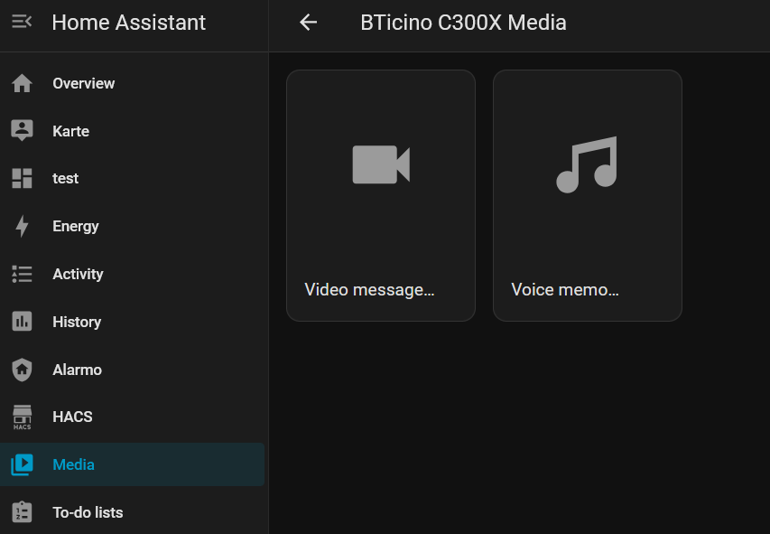

# BTicino Classe 300X for Home Assistant (Unofficial)

[](.github/workflows/validate.yml)
[](custom_components/bticino_c300x/quality_scale.yaml)
[](.github/release-notes/v1.2.1.md)
[](https://www.hacs.xyz/)
[](LICENSE)

Local-first Home Assistant custom integration for the BTicino Classe
300X / C300X video door station.

It brings the door station into Home Assistant as a local device: doorbell
events, camera view, calls, display pages and common controls without depending
on a cloud service for normal operation.

<p align="center">
  
</p>

## What It Does

Use this integration when you want your Classe 300X to behave like a local Home
Assistant device: doorbell events, camera, door calls, door unlock, stair light,
ringer/forwarding controls, messages and optional display pages. Normal
operation is local and push-based.

- **On-demand**: open the door camera from Home Assistant when nobody is
  ringing.
- **Ring Call**: answer the incoming door call from Home Assistant with video,
  device audio and microphone talkback.
- **Home Call**: call the C300X from Home Assistant as an audio-only local
  call.

## Requirements

- Home Assistant `2025.5.0` or newer.
- BTicino Classe 300X / C300X firmware `1.7.x`.
- Root or SSH access on the C300X for the first device-agent installation.
- A trusted local network between Home Assistant and the C300X.

If your device is still stock, root or SSH-enable it first. Rooting and
firmware patching are outside this repository. When a separate rooting workflow
asks for a firmware target, use `1.7.19`.

## Highlights

- See who is at the door from Home Assistant and start the camera on demand.
- Answer a supported incoming door call from the Home Assistant dashboard.
- Call the C300X display from Home Assistant with a dedicated Home Call card.
- Control door unlock, stair light, ringer mute, forwarding and answering
  machine state.
- Show optional Home Assistant, weather and Alarmo pages on the C300X display.
- Use video messages, voice memos and text memos from Home Assistant.
- Build local automations around ring events, captured clips and speech
  analysis.
- Keep day-to-day status simple, with deeper diagnostics available only when
  needed.

Full setup, service, notification and symptom-based troubleshooting details are
in the [User Guide](docs/user-guide.md).

## Screenshots

Screenshots show a representative setup. Exact entities and display pages depend
on the installed agent capabilities and the options enabled in Home Assistant.

### Door Camera Inline Dashboard

<p align="center">
  
</p>

### Home Assistant Entities

<table>
  <tr>
    <td align="center" valign="top"><strong>Controls</strong><br></td>
    <td align="center" valign="top"><strong>Sensors / Events</strong><br><br></td>
    <td align="center" valign="top"><strong>Configuration</strong><br></td>
    <td align="center" valign="top"><strong>Diagnostics</strong><br></td>
  </tr>
</table>

### C300X Display Pages

<table>
  <tr>
    <td align="center"><strong>C300X dashboard</strong><br></td>
    <td align="center"><strong>Alarmo page</strong><br></td>
  </tr>
  <tr>
    <td align="center"><strong>Home Assistant weather page</strong><br></td>
    <td align="center"><strong>Custom Home Assistant page</strong><br></td>
  </tr>
</table>

### Display Bridge Output

<p>
  
</p>

## Project Status

- IoT class: `local_push`
- HACS type: custom integration with `zip_release`
- Quality target: Home Assistant Quality Scale Platinum track
- License: Apache-2.0
- Support scope: community project, not an official BTicino/Legrand or Home
  Assistant Core integration

## Important Requirement: Rooted C300X

The native agent must run on the C300X device. That means the device must already
be rooted or otherwise SSH-enabled with write access for installing the agent.

This repository does not provide firmware images, firmware extraction output,
APKs, exploits, rooting instructions, or vendor files. If your device is still
stock, you first need a separate, compatible rooting/firmware-patching workflow.
One commonly referenced community project for that topic is:

```text
https://github.com/fquinto/bticinoClasse300x
```

Use that kind of workflow at your own risk, without warranty, and only where it
is legal for your device and jurisdiction. When that workflow asks for a
firmware target, select `1.7.19`; this integration and the packaged native
agent are validated against the `1.7.x` firmware family. After SSH/root access
is available, this integration can install and manage the native agent.

The integration installer can copy the bundled native agent to an already
rooted/SSH-enabled device. It cannot root a stock device for you.

## What You Get in Home Assistant

Exact entities depend on the capabilities reported by your installed agent.

| Platform | Typical entities |
| --- | --- |
| `camera` | Doorbell camera |
| `event` | Standard doorbell ring event, optional diagnostic device-event stream |
| `binary_sensor` | Home Call active state |
| `button` | Door unlock, stair light, reboot, reload display, remove device agent, delete latest memo/message |
| `select` | Three-state smartphone forwarding mode |
| `switch` | Ringer mute, answering machine, SSH maintenance, noAuth bootstrap, mDNS, Display patch, firewall patches |
| `sensor` | Device agent status, doorbell state, message/memo counters, optional device metrics and disabled detailed agent diagnostics |

The integration also registers services for door unlock, stair light, Alarmo
commands, dashboard actions, Home Call start/stop, latest video-message
playback/delete, latest voice-memo playback/delete, latest text-memo
write/delete, explicit doorbell-video start/stop, Ring Call answer/hang-up,
Ring Call capture, local Wyoming transcription and strict phrase-match
evaluation for automations.

## Installation

### 1. Install the Home Assistant integration

HACS custom repository:

1. Open **HACS**.
2. Go to **Integrations**.
3. Open **Custom repositories**.
4. Add this repository:

   ```text
   https://github.com/memphi2/ha-bticino-c300x
   ```

5. Category: **Integration**.
6. Install **BTicino C300X**.
7. Restart Home Assistant.

Manual Home Assistant install:

```bash
mkdir -p /config/custom_components
cp -a custom_components/bticino_c300x /config/custom_components/
```

Then restart Home Assistant.

The HACS release asset is `ha-bticino-c300x.zip`. It contains both the Home
Assistant integration and the matching device-agent bundle.

### 2. Add the integration

In Home Assistant:

```text
Settings -> Devices & services -> Add integration -> BTicino C300X
```

The setup flow first asks for the C300X address and local agent API port. In
most installations the API port is `8091`.

- If the native agent is already reachable, setup continues with token and
  feature configuration.
- If the agent is not reachable, setup offers an explicit installer step for a
  rooted/SSH-enabled C300X.

The installer uses the SSH username/password only for that install step. The
credentials are not stored in the Home Assistant config entry, options,
diagnostics, or logs.

Recommended first-run choices:

- Enable the Display patch only if you want the C300X display pages.
- Enable the doorbell camera if you want video, ring-call handling, Home Call
  or talkback in Home Assistant.
- Leave **Create Home Assistant media user** enabled unless you already manage a
  dedicated C300X user yourself. The agent prefers that `homeassistant` media
  identity when present and falls back to an existing fallback media user only when
  no Home Assistant user exists.
- Select an Alarmo entity only when you use Alarmo.
- Select a weather entity only when you want it on the C300X display page.
- Leave destructive maintenance functions disabled until you need them.
- Keep the generated API and maintenance tokens; they are required for later
  reconfiguration and maintenance.

Feature choices are reversible from the integration options. Device-changing
maintenance actions are still explicit: the integration should not change
display files, change firewall scripts, reboot the device, or remove the agent
just because Home Assistant starts.

### 3. Recovery and sensitive values

The setup flow creates and stores the required local agent credentials for you.
Do not paste those values into logs, issues, screenshots or commits. Recovery
details are documented in the [User Guide](docs/user-guide.md#tokens).

### 4. What the installer puts on the device

The installer deploys project-owned files only:

- ARMHF native C agent binary
- generated `config.json` with generated API and maintenance tokens
- init/start script for the native agent
- display support files for the optional C300X display pages
- Display setup helper script
- optional firewall helper state managed by the native agent

The installer does not ship vendor firmware, extracted firmware files, APKs or
third-party controller code.

### 5. Choose optional features

The feature step lets you enable only what you need:

- Doorbell camera/video
- Home Assistant media user for video, ring-call and Home Call media identity
- Live doorstation audio gain
- Ring Call capture audio gain
- C300X display integration
- Alarmo entity for the display page
- Weather entity for the display page
- Dynamic Home Assistant board JSON
- Native MQTT bridge migration
- Stair-light address
- Optional maintenance controls

Device-side setup actions are explicit and are covered in the
[User Guide](docs/user-guide.md). Normal Home Assistant startup must not change
device files.

### 6. After setup

After setup, verify these basics:

- `sensor.bticino_c300x_device_agent_status` should show `ok`.
- The device-agent version should match the integration release or show an
  update Repair.
- `camera.bticino_c300x_doorbell_camera` should be present when video is
  enabled.
- `sensor.bticino_c300x_doorbell_state` should change only from real agent
  doorbell/media events.
- `binary_sensor.bticino_c300x_home_call_active` should follow real Home Call
  start, answer and end events.
- Maintenance entities that can change the device should stay disabled until
  actively needed.

## Daily Use and Details

The [User Guide](docs/user-guide.md) covers the detailed behavior that does not
belong in this README:

- Forwarding modes and Home Assistant media-user setup.
- Doorstation card, Home Call card, HTTPS and microphone requirements.
- Mobile notification examples for Android and iOS.
- Ring Call capture, local Wyoming speech analysis and strict phrase matching.
- Callback URL, IPv6, security, performance, MQTT migration and maintenance.
- Symptom-based troubleshooting and the support checklist.

Short version: keep the C300X agent on a trusted local network, do not expose
its API or media ports to the internet, use HTTPS/Home Assistant Cloud for
browser or mobile microphone access, and use the diagnostics download when
opening issues.

## Project Background and Attribution

Thanks to SlyOldFox for the public C300X groundwork and original community
controller work, and to Niels Faber for Alarmo, which the optional C300X alarm
page is designed around.

Development has been assisted by OpenAI Codex. The resulting code and
documentation are maintained as normal project artifacts in this repository.

## Legal Notes

This repository is an independent community project.

- Unofficial integration: no affiliation with, endorsement by, or sponsorship
  from BTicino, Legrand, Home Assistant, Nabu Casa, HACS, OpenAI, or the
  referenced community projects.
- Trademark notice: BTicino, Classe 300X, Legrand, Home Assistant, HACS, Nabu
  Casa, OpenAI, Codex and other names are used only for compatibility,
  attribution, or descriptive reference and belong to their respective owners.
- This repository does not include vendor firmware, extracted firmware, APKs,
  third-party controller source trees, local device backups, or secrets.
- This repository does not ship codec binaries or codec implementation source
  code. Doorbell media uses the user's Home Assistant/browser media stack; users
  and distributors are responsible for codec availability and any
  jurisdiction-specific patent or licensing requirements.
- License: Apache-2.0, see [LICENSE](LICENSE) and [NOTICE](NOTICE).

See [docs/legal.md](docs/legal.md) for the full legal and asset-hygiene notes.

## Documentation

| Topic | Document |
| --- | --- |
| User guide | [docs/user-guide.md](docs/user-guide.md) |
| Native agent details | [docs/native-agent.md](docs/native-agent.md) |
| Architecture | [docs/architecture.md](docs/architecture.md) |
| Device UI feasibility and safety | [docs/device-ui-feasibility.md](docs/device-ui-feasibility.md) |
| Security policy | [SECURITY.md](SECURITY.md) |
| Privacy notice | [PRIVACY.md](PRIVACY.md) |
| Legal notes | [docs/legal.md](docs/legal.md) |
| Changelog | [CHANGELOG.md](CHANGELOG.md) |
